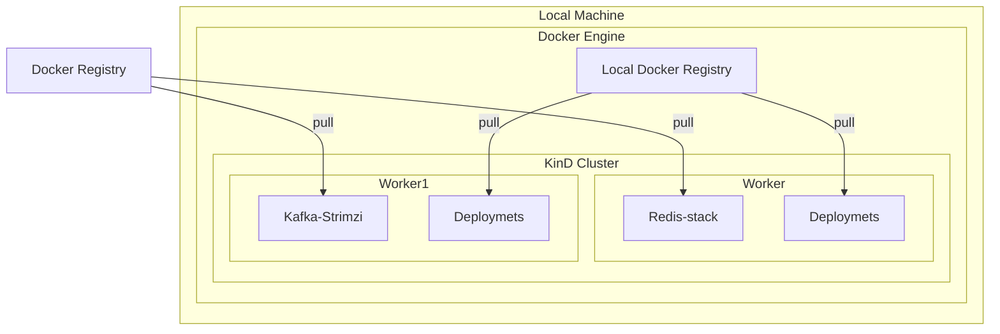
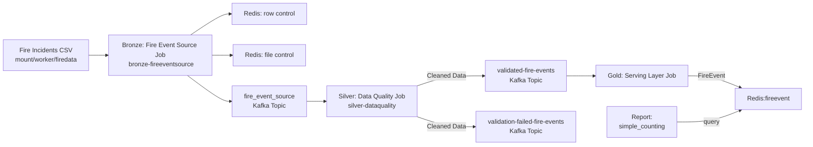

# Fire Incidents KinD Cluster Project

This project provides a reproducible local Kubernetes environment for analyzing San Francisco Fire Incidents data using KinD (Kubernetes in Docker), Tilt, and a set of supporting services (Kafka, Redis, Superset, etc.). It is designed for rapid prototyping, data engineering, and analytics workflows, leveraging containerized infrastructure and declarative configuration.

---

## 🛠️ Prerequisites

- **Docker** installed and running
- **KinD** CLI ([installation guide](https://kind.sigs.k8s.io/docs/user/quick-start/#installation))
- **make** utility
- **Tilt** ([installation guide](https://docs.tilt.dev/install.html))
- **Helm** (for local Helm chart management)

---

## ⚡ Quickstart

1. **Clone the repository**:

    ```bash
    git clone https://github.com/calebebrim/fireplacesftest.git
    cd fireplacesftest
    ```
    After cloning, download and add the data file under `mount/worker/firedata`:

    - Download `Fire_Incidents_20250530.csv` manually from [SF Open Data](https://data.sfgov.org/Public-Safety/Fire-Incidents/wr8u-xric/about_data).

2. **Start the environment**:

    ```bash
    make quickstart
    tilt up
    ```
    This will:
    - Start a local Docker registry on port 5000.
    - Create a KinD cluster named `fireplace` using [`kind-config.yaml`](kind-config.yaml).
    - Launch Tilt, which builds images and deploys all Kubernetes resources.

3. **Verify the cluster is running**:

    ```bash
    kind get clusters
    kubectl cluster-info --context kind-fireplace
    ```

4. **Stop everything**:

    - Stop Tilt with `ctrl+c` (or `tilt down` if running detached).
    - Tear down the cluster and registry:

    ```bash
    make shutdown
    ```

---

## 📁 Project Structure

- **[Makefile](Makefile)**  
  Automates cluster creation, deletion, Docker registry management, and image builds.
- **[kind-config.yaml](kind-config.yaml)**  
  KinD cluster configuration: 1 control-plane, 2 workers, local registry mirror, and host path mounts for persistent data.
- **[Tiltfile](Tiltfile)**  
  Main Tilt configuration: orchestrates image builds and Kubernetes resource deployment.
- **[infra.Tiltfile](infra.Tiltfile)**  
  Defines reusable Tilt functions for installing infrastructure components (Kafka, Redis, Superset, etc.).
- **[docker/](docker/)**  
  - `base.dockerfile`: Base image for Python services.
  - `superset.dockerfile`: Custom build for Apache Superset.
- **[k8s/](k8s/)**  
  Kubernetes manifests for all services (Kafka, Redis, Postgres, MinIO, Superset, data jobs, etc.).
- **[mount/](mount/)**  
  Host directories mounted into KinD nodes for persistent storage and data sharing.
- **[src/](src/)**  
  Python source code for data analysis and services (see below).
- **[requirements.txt](requirements.txt)**  
  Python dependencies: `redis`, `confluent-kafka`, `pandas`.

---

## 🚀 Usage

### Cluster Management

- **Create a KinD cluster** (default name: `kind-cluster`):

    ```bash
    make install
    ```

- **Custom cluster name**:

    ```bash
    make install CLUSTER_NAME=my-cluster
    ```

- **Custom KinD config**:

    ```bash
    make install KIND_CONFIG=custom-kind.yaml
    ```

- **Delete a cluster**:

    ```bash
    make uninstall
    # or
    make uninstall CLUSTER_NAME=my-cluster
    ```

- **Show help**:

    ```bash
    make help
    ```

### Helpful Kubernetes Commands

- List all clusters:

    ```bash
    kind get clusters
    ```

- Check cluster status:

    ```bash
    kubectl cluster-info --context kind-<CLUSTER_NAME>
    ```

---

## 🏗️ Infrastructure & Services

### Local Docker Registry

- Started by `make quickstart` on `localhost:5000`.
- KinD nodes are configured to use this registry for fast image pushes.

### KinD Cluster

- Defined in [`kind-config.yaml`](kind-config.yaml):
    - 1 control-plane node (`mount/control-plane` mounted at `/data`)
    - 2 worker nodes (`mount/worker` and `mount/worker2` mounted at `/data`)
    - Local registry mirror for efficient image pulls

### Tilt Orchestration

- [`Tiltfile`](Tiltfile) loads [`infra.Tiltfile`](infra.Tiltfile) and defines deployment steps:
    - **build_base_image**: Builds the base Python image from `docker/base.dockerfile`.
    - **install_infra**: Installs infrastructure components (Kafka, Redis) using Helm and raw manifests.
    - **deploy_fireeventsource**: Deploys the bronze fire event source job.
    - **deploy_data_quality**: Deploys the silver data quality job.
    - **deploy_data_serving**: Deploys the gold serving layer.
    - **deploy_simple_counting_job_report**: Deploys a simple counting job.

#### [`infra.Tiltfile`](infra.Tiltfile) details:

- **Kafka**: Installed via Strimzi Helm chart and custom manifests.
- **Redis**: Deployed with port-forwards and manual trigger mode.
- **Superset**: Can be installed via Helm with custom Docker image (see `install_superset_helm`).
- **MinIO**: Example provided but commented out (not currently used).
- **Postgres**: Example provided but commented out (Redis is preferred for speed).

### Kubernetes Manifests

- All service definitions are in [`k8s/`](k8s/):
    - `bronze-fireeventsource.yaml`: Bronze layer data ingestion job.
    - `silver-dataquality.yaml`: Silver layer data quality job.
    - `gold-serving-layer.yaml`: Gold layer serving job.
    - `simple-counting-job.yaml`: Example analytics job.
    - `kafka.yaml`, `kafkastorageclass.yaml`: Kafka and storage setup.
    - `postgres.yaml`, `redis.yaml`: Database and cache.
    - `s3like-minIO.yaml`: S3-compatible storage (not currently active).
    - `superset.yaml`, `superset-helm-values.yaml`: BI dashboard.

---

## 🧑‍💻 Application Code

- **[src/](src/)** contains Python code for data ingestion, processing, and analytics.
    - Uses `redis`, `confluent-kafka`, and `pandas` (see [`requirements.txt`](requirements.txt)).
    - Organized into:
        - `analysis/`: Data analysis example scripts and query. 
        - `services/`: Microservices for data movement and transformation.

---

## 🗄️ Data Management

- **Persistent Data**: Host directories under `mount/` are mounted into KinD nodes for sharing data between jobs and for persistence.
    - `mount/worker/firedata/Fire_Incidents_20250530.csv`: Main dataset (add manually).
- **.gitignore**: Prevents large or sensitive data from being committed.

---

## 📄 Example KinD Config File

```yaml
kind: Cluster
apiVersion: kind.x-k8s.io/v1alpha4
containerdConfigPatches:
  - |-
    [plugins."io.containerd.grpc.v1.cri".registry.mirrors."localhost:5000"]
      endpoint = ["http://localhost:5000"]
nodes:
  - role: control-plane
    extraMounts:
      - hostPath: ./mount/control-plane
        containerPath: /data
  - role: worker
    extraMounts:
      - hostPath: ./mount/worker
        containerPath: /data
  - role: worker
    extraMounts:
      - hostPath: ./mount/worker2
        containerPath: /data
```

---

## ℹ️ Additional Notes

- The `Makefile` has a `help` target to show usage:

    ```bash
    make help
    ```

- Ensure Docker has enough resources (CPU, memory) allocated for your cluster.
- For Ingress or LoadBalancer features, update `kind-config.yaml` with port mappings as needed.
- To extend the setup (e.g., auto-load images, install more tools), edit the [`Tiltfile`](Tiltfile) and [`infra.Tiltfile`](infra.Tiltfile).

---

## 🧩 Extending the Project

- **Add new data jobs**: Place new manifests in `k8s/` and add deployment functions to the [`Tiltfile`](Tiltfile).
- **Add Python dependencies**: Update [`requirements.txt`](requirements.txt) and rebuild the base image.
- **Add new services**: Use Helm or raw manifests, and manage them via [`infra.Tiltfile`](infra.Tiltfile).

---

## 📝 License & Contributions

- Contributions welcome! Please open issues or PRs for improvements.
- License: [Specify your license here]

---

🎉 **That’s it!** You’re ready to spin up and tear down a full-featured local data platform using KinD, Tilt, and Kubernetes!

If you have any questions or want to extend this setup, let me know! 🚀


## 📊 Architecture Diagram

### Infrastructure


### Data Pipeline

